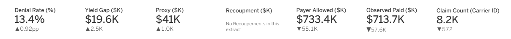
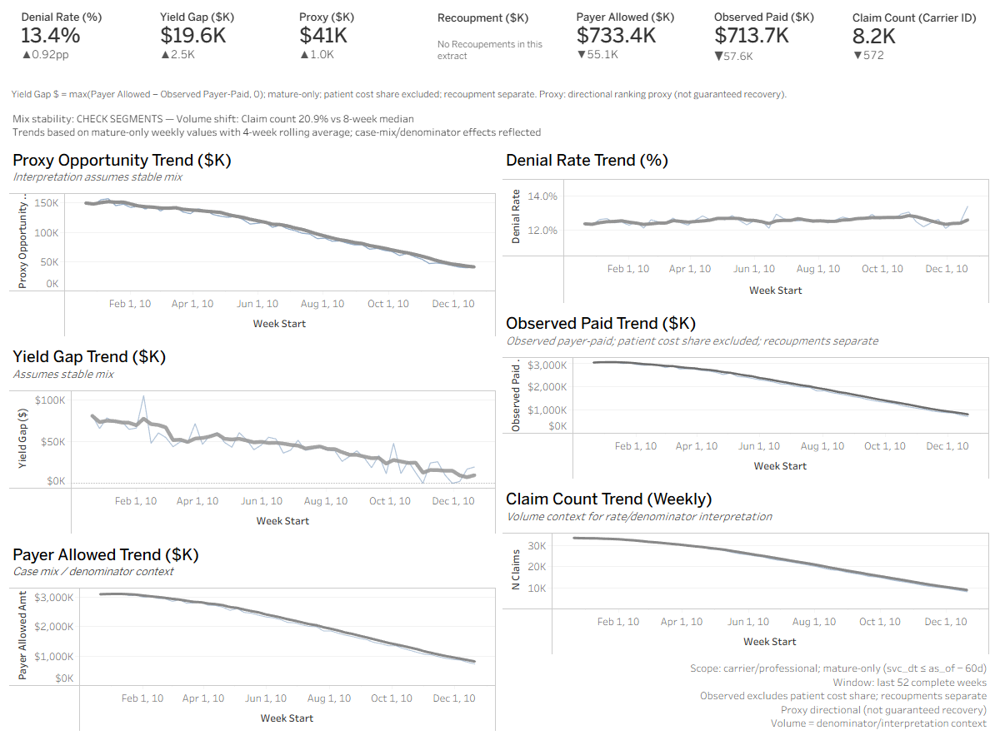
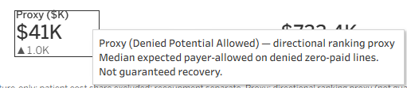

# Revenue Cycle Executive Overview — Tab 1: KPI Strip & Trends


**Enterprise-grade weekly KPI dashboard with partial-week guardrails and mature-claims maturity rules.**

Built with **dbt** + **BigQuery SQL** + **Tableau** using CMS DE-SynPUF synthetic claims data.

---

## 🚀 View in 60 Seconds

**What You'll See:**
- 7 KPI cards with week-over-week (WoW) deltas in $K format
- Partial-week banner (auto-hides when data is complete)
- 52-week trend lines with complete-week annotations
- Mix stability sentinel (alerts on case-mix shifts)

**Key Innovation:** Automatic complete-week anchoring prevents false WoW spikes from incomplete data streams.

**Screenshots:**

| KPI Strip (7 Cards) | Trend Lines (52 Weeks) | Proxy Tooltip |
|---------------------|------------------------|---------------|
|  |  |  |

**Quick Stats:**
- **1-row snapshot** (DS0) + **52-week series** (DS1)
- **11 automated tests** (5 DS0, 2 DS1, 3 CI/QC, 1 schema)
- **60-day maturity** enforced upstream (stable payment metrics)
- **70% volume threshold** for complete-week detection

**Try It:** See [REPRO_STEPS.md](docs/REPRO_STEPS.md) for full reproduction (2-4 hours first-time setup).

---

## What This Is

Single-page executive dashboard providing stable week-over-week (WoW) metrics for revenue cycle operations:

- **KPI Strip (DS0):** 7 headline metrics anchored to latest *complete* week (no partial-week artifacts)
- **Trend Lines (DS1):** 52-week historical series with complete-week flagging
- **Operational Guardrails:** Mix stability sentinel, partial-week banner, maturity-period enforcement

---

## Why This Matters

### 1. Partial-Week Defense
Traditional dashboards spike when incomplete weeks enter the data stream (volume artifacts, not performance changes). This implementation:

- Detects partial weeks via trailing 8-week median claim volume (70% threshold)
- Anchors KPI strip to **latest complete week only**
- Compares WoW against **prior complete week** (not calendar prior)
- Displays banner when partial-week data is present

### 2. Maturity Period Enforcement
Revenue cycle metrics require **60-day service-date maturity** to avoid false trends:

- Payer Yield Gap calculated on claims 60+ days old (mature payment window)
- Upstream staging models enforce maturity filter before aggregation
- Dashboard shows `as_of_date` to clarify observation window

### 3. Operational Guardrails
Mix stability sentinel alerts when case-mix or volume shifts exceed **15% vs 8-week trailing median**:

- Triggers "CHECK SEGMENTS" flag on KPI strip
- Prevents misinterpretation of compositional changes as performance trends
- Tooltip displays specific shift magnitude and direction

---

## What Shipped

### Data Models (dbt)

| Model | Purpose | Grain | Materialization |
|-------|---------|-------|----------------|
| `mart_exec_overview_latest_week` (DS0) | Single-row KPI strip | 1 row (latest complete week) | View |
| `mart_exec_kpis_weekly_complete` (DS1) | Historical trend series | Weekly (52 complete weeks) | View |
| `mart_exec_kpis_weekly_complete` | Base weekly aggregates (complete weeks only) | Weekly (all weeks) | Table |

**Key Features:**
- WoW deltas in $K format (e.g., `wow_yield_gap_amt_k = 125.3`)
- Prebuilt label fields with arrows (`yield_gap_wow_label = "▲125.3K"`)
- Partial-week detection and banner fields
- Mix stability flag with reason text

### Tableau Dashboard


**Components:**
1. **KPI Cards (7):** Current value + WoW label with arrow
2. **Partial Week Banner:** Conditional display when `is_partial_week_present = TRUE`
3. **Mix Stability Alert:** Shows `mix_stability_reason` when flagged
4. **Trend Lines:** 52-week series with complete-week annotations
5. **Metric Tooltips:** Definitions + disclaimers embedded

---

## Metric Definitions & Disclosures

### Payer Yield Gap ($)
**Definition:** `MAX(Payer Allowed − Observed Payer-Paid, 0)` on mature claims (60+ days old)

**Disclosures:**
- Mature claims only (service date ≤ `as_of_date − 60 days`)
- Observed payer-paid **excludes patient cost-share** (deductibles, coinsurance)
- Recoupments (negative payments) tracked separately, not netted

### Denied Potential Allowed Proxy ($)
**Definition:** Expected payer-allowed assigned to denied zero-paid lines using HCPCS-level medians

**Disclosures:**
- **Directional ranking proxy only; not guaranteed recovery amount**
- Waterfall logic: HCPCS (min 100 lines) → HCPCS3 → GLOBAL median
- Submitted charges unavailable in synthetic data (conservative approach)


*Tooltip language:* "Median expected payer-allowed on denied zero-paid lines; ranking proxy not guaranteed recovery."

### $At-Risk
**Definition:** `Payer Yield Gap + Denied Potential Allowed Proxy`

**Disclosure:** Combined operational metric representing total dollar exposure for revenue integrity workstreams (leakage + denial prevention).

### Denial Rate (%)
**Definition:** `COUNTIF(denial_PRCSG) / COUNTIF(comparable_lines)`

**Disclosures:**
- Denial codes: C, D, I, L, N, O, P, Z
- Excludes MSP/COB codes and administrative processing codes from denominator
- Line-level calculation (not claim-level)

### Claim Count
**Definition:** Distinct `claim_id` count (Carrier claims schema)

**Note:** CMS Carrier Claims = professional/physician claims; excludes inpatient/outpatient.

---

## Validation Summary

**Acceptance Queries (5):**

| Test | File | PASS Criteria |
|------|------|---------------|
| Row count | `acceptance_query_ds0_row_count.sql` | `COUNT(*) = 1` |
| Anchor week | `acceptance_query_ds0_anchor_week.sql` | `week_start = latest_complete_week_start` |
| WoW population | `acceptance_query_ds0_wow_nonnull_when_prior_exists.sql` | All WoW fields NOT NULL when prior exists |
| Denial rate magnitude | `acceptance_query_ds0_wow_denial_rate_magnitude.sql` | `wow_denial_rate_pp` matches `100×(rate_diff)` |
| Comprehensive | `acceptance_query_ds0_comprehensive.sql` | All requirements A–E pass |

**Additional Tests:**
- Proxy WoW validation: `acceptance_query_ds0_proxy_wow.sql`
- CI/QC tests in `tests/`: Maturity enforcement, sample reconciliation, identity checks

---

## How to Run

### Prerequisites
- dbt 1.11+ with BigQuery adapter
- Google Cloud project with BigQuery enabled
- CMS DE-SynPUF synthetic claims data loaded

### Build Models
```bash
# Full pipeline
dbt build

# Executive marts only
dbt run --select marts.mart_exec_overview_latest_week
dbt run --select marts.mart_exec_kpis_weekly_complete

# Run acceptance tests
dbt test
```

### Connect Tableau
1. Data sources:
   - **DS0:** `mart_exec_overview_latest_week` (KPI strip)
   - **DS1:** `mart_exec_kpis_weekly_complete` (trends)
2. DS1 filter: `in_last_52_complete_weeks = TRUE`
3. KPI strip: Use `ATTR([*_wow_label])` fields for WoW display

See [tableau/README_tableau.md](tableau/README_tableau.md) for detailed integration steps.

### Explore Pre-Built Tableau Workbook
**File:** [tableau/exec_overview_tab1.twbx](tableau/exec_overview_tab1.twbx) (Tableau Packaged Workbook)

**What's Inside:**
- KPI Strip (7 cards) with WoW labels
- Partial Week Banner (conditional display)
- Mix Stability Alert (tooltip-based)
- 52-Week Trend Lines (4 charts)
- Embedded data samples for demo/layout reference

**How to Open:**
1. **Tableau Desktop:** File → Open → Select `exec_overview_tab1.twbx`
2. **Expected Version:** Tableau 2021.1+ (packaged workbook format)

**How to Swap to Your BigQuery Connection:**
1. Data → `DS0_exec_overview_latest_week` → Edit Data Source
2. Connect to your BigQuery project:
   - Project: `<your-project-id>`
   - Dataset: `rcm`
   - Table: `mart_exec_overview_latest_week`
3. Repeat for `DS1_exec_kpis_weekly_complete`
4. Apply data source filter: `in_last_52_complete_weeks = TRUE`

**⚠️ Data Disclaimer:**  
No PHI; uses CMS DE-SynPUF synthetic claims data only. Safe for public GitHub distribution.

---

## Technical Documentation

| Doc | Purpose |
|-----|---------|
| [Exec Overview Spec](docs/00_exec_overview_spec.md) | Dashboard layout hierarchy (DS0 vs DS1) |
| [Metric Definitions](docs/01_metric_definitions.md) | Semantic definitions + patient cost-share rules |
| [Data Contract](docs/02_data_contract_ds0_ds1.md) | DS0/DS1 field specifications |
| [Validation](docs/03_validation_acceptance.md) | Acceptance criteria + QC gates |
| [Decision Memo](docs/decision_memo.md) | Strategic context + partial-week rationale |
| [Metric Dictionary](docs/metric_dictionary.md) | Comprehensive metric catalog |

---

## Key Design Decisions

### Complete-Week Anchoring
**Problem:** Partial weeks cause false WoW spikes (volume artifacts).

**Solution:** Dynamic complete-week detection using 8-week trailing median (70% threshold). DS0 automatically skips partial weeks; DS1 flags them for trend annotation.

### WoW in $K Format
**Problem:** Tableau calculated fields create inconsistent formatting across KPI cards.

**Solution:** Pre-compute WoW deltas in SQL (`/ 1000.0`), emit prebuilt labels (`"▲125.3K"`). Single-source formatting logic.

### Denial Rate in Percentage Points
**Problem:** "1.5% increase" is ambiguous (relative vs absolute change).

**Solution:** Express WoW as percentage points (`wow_denial_rate_pp = 100×Δrate`). Industry-standard approach.

### Proxy Transparency
**Problem:** Denied potential allowed requires estimation (submitted charges unavailable).

**Solution:** HCPCS-level median baseline with waterfall logic. Label as "directional ranking proxy" in all tooltips. Exclude from ROI claims.

---

## Data Lineage

```
CMS DE-SynPUF Raw CSVs (Carrier Claims)
    ↓
stg_carrier_lines_long (base extract)
    ↓
stg_carrier_lines_enriched (payment/denial logic)
    ↓
int_denied_potential_allowed_lines (proxy assignment)
    ↓
mart_workqueue_claims (claim-grain operational mart)
    ↓
mart_exec_kpis_weekly_complete (weekly aggregates, complete weeks only)
    ↓
├─ mart_exec_kpis_weekly_complete (DS1: 52-week series)
└─ mart_exec_overview_latest_week (DS0: single-row KPI strip)
```

**Maturity Filter Applied:** `stg_carrier_lines_enriched` enforces 60-day service date filter before all aggregations.

**📊 Data Acquisition:**  
Raw CMS DE-SynPUF datasets are **not stored in this repository** due to size constraints (files exceed 100MB). See [docs/DATA_POLICY.md](docs/DATA_POLICY.md) for download instructions and local storage recommendations. For step-by-step reproduction, see [docs/REPRO_STEPS.md](docs/REPRO_STEPS.md).

---

## Limitations & Disclosures

### Synthetic Data Context
- **CMS DE-SynPUF:** Synthetic claims data (not real patient records)
- **No 837/835 transactional detail:** Cannot calculate true submitted charges or exact adjudication sequences
- **Proxy methodology required:** Denied potential allowed uses HCPCS medians as conservative estimate

### Scope Boundaries
- **Carrier claims only:** Professional/physician services (excludes inpatient, outpatient, DME)
- **Payer-side only:** Patient cost-share tracked separately, not included in "observed paid"
- **60-day maturity window:** Shorter windows may show payment velocity artifacts

### Use Case Fit
✅ **Appropriate for:**
- Weekly executive monitoring of revenue cycle trends
- Prioritizing denial prevention workstreams (directional ranking)
- Detecting case-mix or volume shifts requiring segment drill-down

❌ **NOT appropriate for:**
- Exact recovery dollar projections (proxy is directional only)
- Real-time operational monitoring (60-day lag inherent)
- Patient-side payment tracking (cost-share excluded)

---

## Contributors

Built by **Allen** as part of healthcare revenue cycle analytics portfolio.

**Tech Stack:** dbt (SQL), BigQuery, Tableau, CMS DE-SynPUF synthetic data

---

## License

MIT License — See [LICENSE](LICENSE) for details.

---

## Questions?

See [docs/](docs/) for detailed technical specifications, or review acceptance queries in repo root for validation examples.
