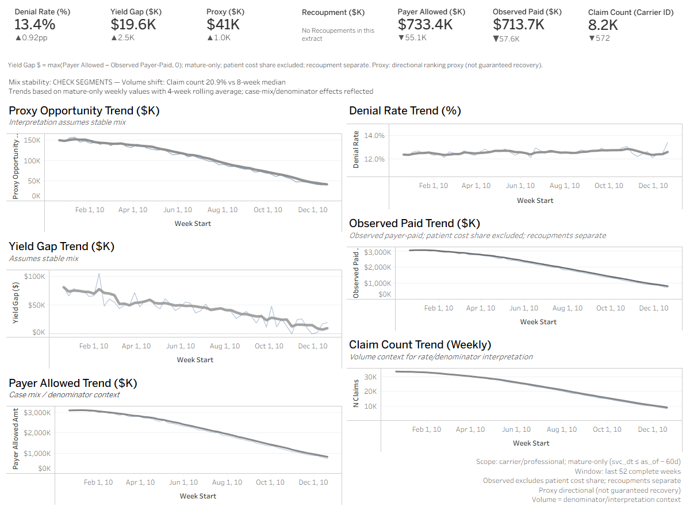

# Revenue Cycle Executive Overview - Tab 1: KPI Strip and Trends

**Enterprise-grade weekly KPI dashboard with partial-week guardrails and mature-claims maturity rules.**

This project is a **Tableau + Google BigQuery dashboard demonstration** built to deliver a **decision-ready view of denial exposure and workqueue priorities without relying on ad hoc analysis**.

**Quick Links:** [View Dashboard](docs/images/tab1.png) | [STAR Impact](portfolio/STAR_IMPACT_SUMMARY.md) | [Setup Guide](docs/REPRO_STEPS.md) | [Metric Definitions](docs/01_metric_definitions.md)

## Start Here (Hiring Manager)
No Tableau required.

- [Executive System Overview](docs/EXECUTIVE_SYSTEM_OVERVIEW.md)
- [Executive PDF Pack Index](docs/pdf/EXECUTIVE_PDF_PACK_INDEX.md)
- PDF briefs provide a decision-ready view of denial exposure and workqueue priorities:
- [Denials Triage Brief (PDF)](docs/pdf/denials_triage_brief_v1.pdf)
- [Denials Prevention Brief (PDF)](docs/pdf/denials_prevention_brief_v1.pdf)
- [Denials Recovery Brief (PDF)](docs/pdf/denials_recovery_brief_v1.pdf)
- [Denials RCI Brief (PDF)](docs/pdf/denials_rci_brief_v1.pdf)
- [Proof Pack Index](docs/PROOF_PACK_INDEX.md)

## Operator Deep Dive
- [Denials Triage Runbook (1 Page)](docs/denials_triage_runbook_1page.md)
- [Denials Workqueue Tracker Template](docs/templates/denials_workqueue_tracker_template.md)
- [RCI Ticket Pack (PDF)](docs/denials_rci_ticket_pack_v1.pdf)
- [RCI Ticket Template](docs/templates/denials_rci_ticket_template.md)

## Architecture (what this project demonstrates)
Production path: BigQuery (warehouse) -> dbt (marts) -> Tableau dashboards + Jupyter storytelling notebooks.

Portfolio path (reproducible): Offline fixtures (exports of marts) -> notebooks render the same story pages/memos without cloud access.

Built with **dbt** + **BigQuery SQL** + **Tableau** using CMS DE-SynPUF synthetic claims data.

---

## Optional deep dives (if you want more)
Notebook-driven executive and story artifacts (KPI + workqueue): [docs/NOTEBOOKS_INDEX.md](docs/NOTEBOOKS_INDEX.md)
