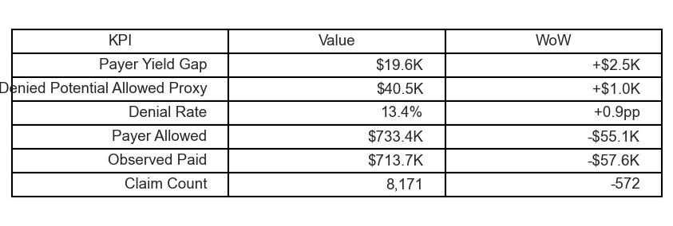
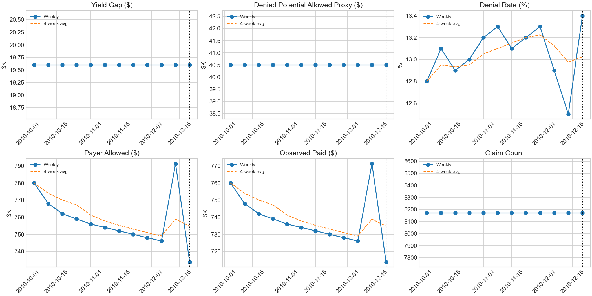
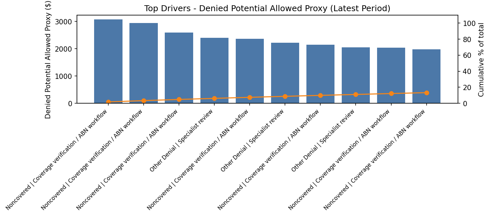
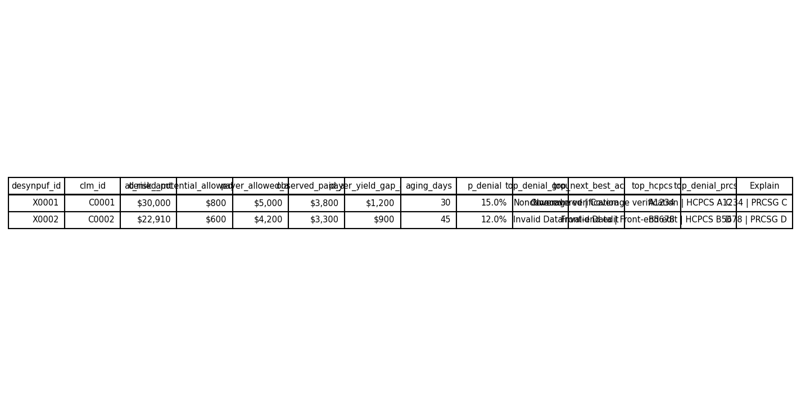

# Case Study — Weekly RCM Executive Brief (Overview → Drivers → Workqueue)

**One-week executive decision brief that converts KPI movement into a defensible operating decision in under 10 minutes.**

**Quick links:** [Executive System Overview](EXECUTIVE_SYSTEM_OVERVIEW.md) · [Metric Definitions](01_metric_definitions.md) · [Workqueue Memo](workqueue_memo_latest_week.md) · [Proof Pack](PROOF_PACK_INDEX.md)

---

## 1) Business Problem
RCM leaders need to explain weekly variance quickly **without overreacting to partial-week noise** or overclaiming root cause.

This case study demonstrates a repeatable pathway:
1. **Overview:** detect movement in paid/allowed/denial KPIs.
2. **Drivers:** isolate directional contributors with transparent limits.
3. **Workqueue:** convert findings into a reversible, owner-based action plan.

---

## 2) Visual Executive Snapshot

### KPI strip + trend context

### Driver concentration (Pareto)

### Workqueue (actionable top opportunities)

> These visuals are generated from the project mart layer and notebook story pipeline, then published for executive review.

---

## 3) Method (what makes this decision-safe)
- **Mature-week guardrail:** excludes incomplete periods to reduce false directional signals.
- **Comparator discipline:** requires prior comparable context before asserting week-over-week interpretation.
- **History-tier labeling:** indicates confidence context (e.g., 12-week tier) rather than implying causal certainty.
- **Ops handoff:** output always ends in owner/time-boxed options, not just analytics commentary.

---

## 4) Findings (latest complete + mature week)
- **Paid:** **$57.6K WoW decline**
- **Allowed:** **$55.1K WoW decline**
- **Denial rate:** **13.4%** (**+0.9pp WoW**)
- **Signal status:** `LIMITED_CONTEXT` (volume-shift flagged; partial-week risk high; comparator present; 12w history tier)

Interpretation: there is enough directional evidence to act cautiously, but not enough certainty to justify irreversible staffing expansion.

---

## 5) Decision and Action Options
### Decision made
**Hold queue expansion** and run reversible validation before capacity changes.

### Decision support menu (max 3 options)
| Option | Owner(s) | SLA | Deliverable |
|---|---|---:|---|
| **A. Validate / Segment** | Analyst + Billing Ops | 48h | Segment-level confirmation of shift and queue composition |
| **B. Denial containment** | Denials Team | 7d | Immediate rule/routing actions for top denial buckets |
| **C. Underpayment probe** | Contracting + Payment Ops | 7d | Targeted underpayment check for highest-value slices |

---

## 6) Why this case study is credible
- Built on a **dbt BigQuery mart layer** with explicit transformation contracts.
- Uses a **traceable metric dictionary** and reproducible notebook-to-brief publishing path.
- Separates **decision signal** from **causal claim** to protect operational trust.

---

## 7) Limitations (explicitly stated)
- Synthetic dataset (DE-SynPUF-style context), not production PHI.
- No remit/EOB adjudication depth in this slice.
- Several features are proxy-derived and intended for directional triage.
- Anchor-week perspective; not a longitudinal causal model.

---

## 8) Reuse Pattern (for teams adopting this approach)
If copied into another RCM domain, keep the same order:
**guardrails → executive snapshot → driver isolation → owner-based options → declared limits.**

That sequence is what keeps decision velocity high without sacrificing analytic integrity.
