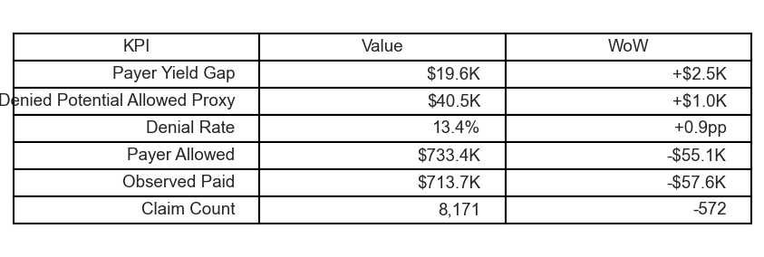
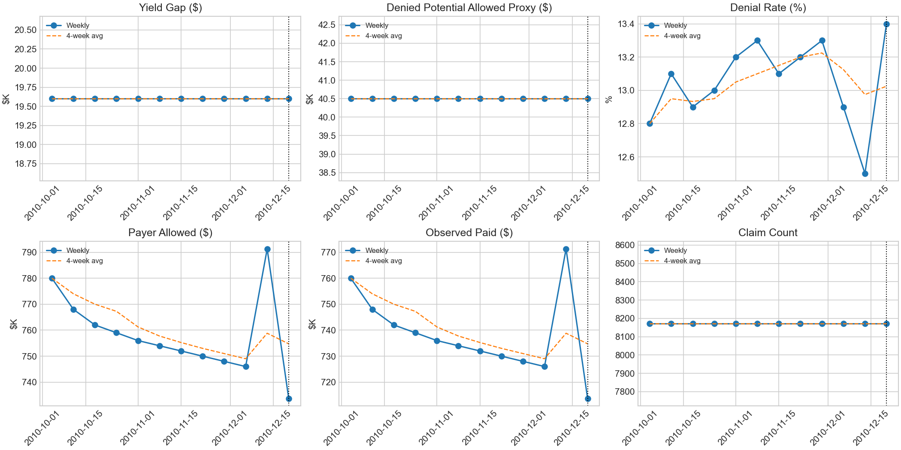

# Decision Memo - Exec Overview (Latest Complete + Mature Week)

## Visuals

## Recommendation (conditional)
- If mix stability is CHECK SEGMENTS: investigate volume/segment mix first; defer queue expansion until drivers are validated.

## What moved (from DS0; reconciles to KPI table)
- Observed Paid: down $57.6K
- Denial Rate: 13.4% (Delta +0.9pp)
- Payer Allowed: down $55.1K

## Receipt (trust stamp)
- Model as_of_date (from marts): 2026-01-07
- Anchor week: 2010-12-20
- Comparator: 2010-12-13
- Service timeline (complete weeks): 2010-10-04 to 2010-12-20 (12 weeks)
- Included weeks: complete-week only (DS1); mature-only enforced upstream
- Mix stability: CHECK SEGMENTS - Volume shift: Claim count 20.9% vs 8-week median

## Notes / interpretation status
- Interpretation status: INVESTIGATE - Volume shift: Claim count 20.9% vs 8-week median
- Paid vs Allowed differences are claim-file amounts used for directional prioritization, not adjudicated underpayment findings.
- Denied Potential Allowed Proxy is directional prioritization only; not guaranteed recovery.

## Follow-ups (not executed in NB-03)
- NB-04 (Drivers): quantify top contributors (contribution/composition; not causal claims).
- NB-05 (Workqueue): demonstrate prioritization using proxy metrics with explicit no-recovery guarantee language.