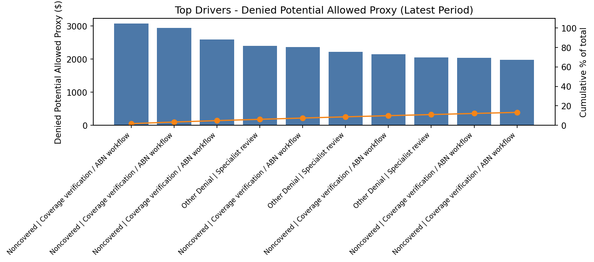

# Driver Memo - Contribution Pareto (Latest Available Period)

## What this is (no causality)
Contribution/composition view from DS2 marts. This does not establish causality.

## Receipt
- Period: 2010-12-01
- Anchor week (if DS0 available): 2010-12-20
- Metric basis: Denied Potential Allowed Proxy (directional prioritization only)
- Source: mart_denial_pareto (DS2)
- Generated on: 2026-01-30 13:19:24

## Top drivers (contribution)
- Top driver: Noncovered | Coverage verification / ABN workflow - 1.7% of period total
- Next: Noncovered | Coverage verification / ABN workflow, Noncovered | Coverage verification / ABN workflow

## So what (conditional)
- If NB-03 Mix = OK: prioritize next-best-action workflows for top drivers.
- If NB-03 Mix = CHECK SEGMENTS: validate segment mix before acting.

## Guardrails
- Proxy values are directional prioritization only; not guaranteed recovery.
- This view is contribution/composition, not causality.

