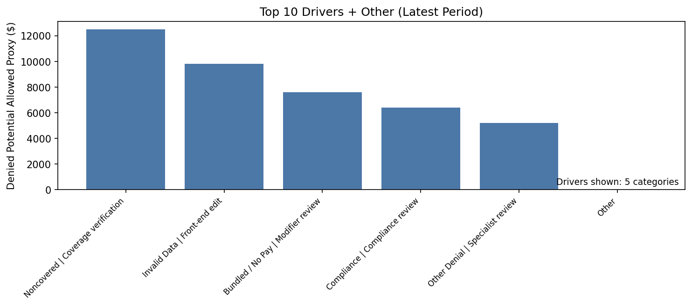
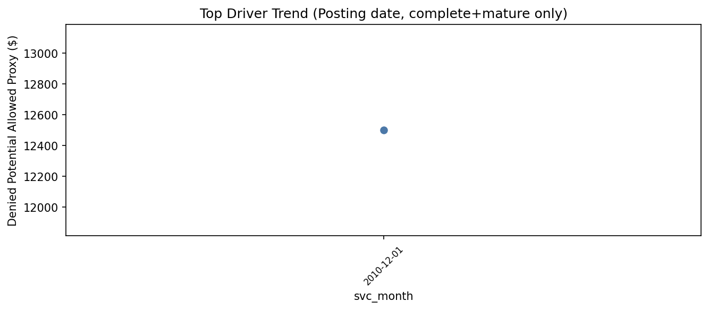

# Drivers (NB-04) - Pareto of contributors (marts-only)

## Interpretation rule
Drivers show contribution/composition, not causality.

## Visuals

Interpretation: Contribution view for the latest period; use it to prioritize where to look first.

Interpretation: Shows the biggest contributors and whether the tail is material.

Interpretation: Shows if the top driver is persistent vs a one-period spike.

## What to do next
If interpretation status is STABLE: proceed to NB-05 workqueue prioritization.
If INVESTIGATE: validate mix/volume shifts before queue expansion.