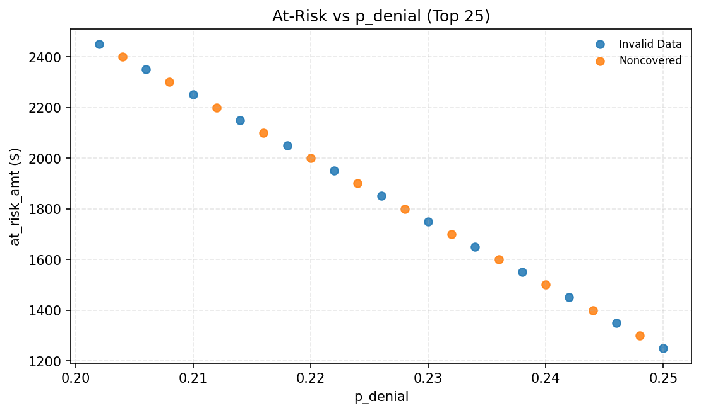

# Workqueue (NB-05) - Top 25 prioritized items (marts-only)

## What this is
Operational prioritization demo using proxy ranking (not guaranteed recovery).

## Visuals

Interpretation: Shows the top 25 items by at-risk exposure for rapid triage.

Interpretation: Shows how quickly exposure accumulates as you move down the list.

Interpretation: Highlights high at-risk and high p_denial items for focused action.

## Context
Top 25 at-risk: $46,250 (0.00% of total $0)

## Next step
If INVESTIGATE: resolve mix/volume shift drivers first (NB-04), then allocate queue capacity.