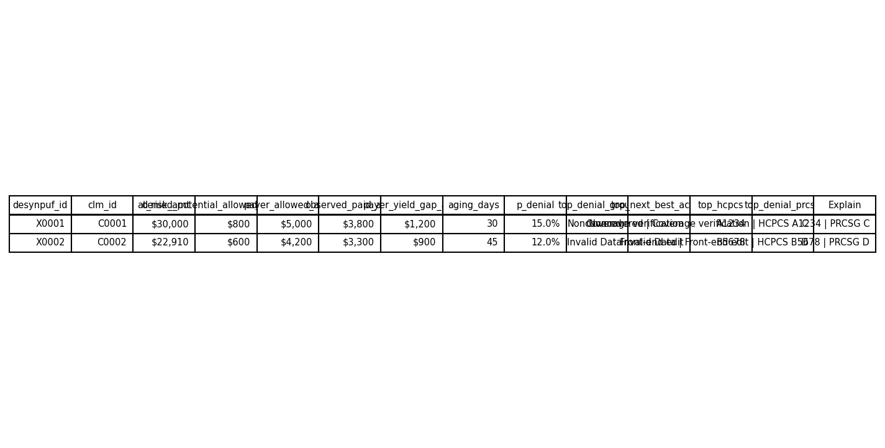

# Workqueue Memo - Prioritized Claims (Demo)

## What this is
This is a prioritization demo built from DS3 marts outputs. It is not a guarantee of recoveries.

## Receipt
- Anchor week (if DS0 available): 2010-12-20
- Ranking basis: at_risk_amt
- Top N shown: 25
- Capacity assumption: 250/day
- Source: mart_workqueue_claims (DS3)
- Generated on: 2026-01-30 17:36:04

## Queue preview (Top N)
Top 25 at-risk: $52,910 (0.0% of total $115,112,420)

## How to use this
- Start with the highest at-risk exposure.
- Use the explainability columns to route to the correct workflow (action/category).
- If mix stability is CHECK SEGMENTS in NB-03, treat queue as provisional until drivers are validated.

## Guardrails
- Proxy values are directional prioritization only; not guaranteed recovery.
- Paid vs Allowed differences are claim-file amounts used for directional triage, not adjudicated underpayment findings.